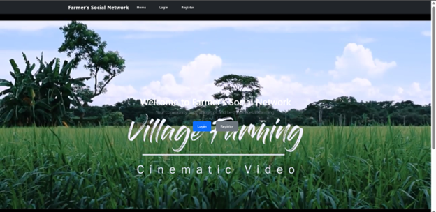
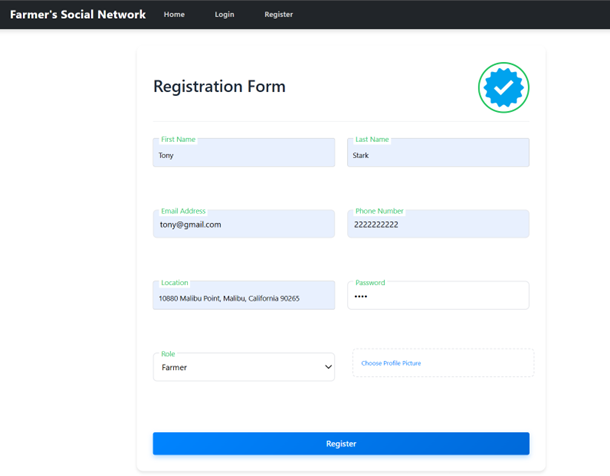

# 🌾 Farmer's Social Network

A comprehensive platform connecting farmers and agronomists to share knowledge, access AI-driven insights, and collaborate for improved agricultural practices.



## 📋 Table of Contents
- [Overview](#overview)
- [Key Features](#key-features)
- [Technology Stack](#technology-stack)
- [User Roles](#user-roles)
- [System Architecture](#system-architecture)
- [Modules](#modules)
- [Database Design](#database-design)
- [Machine Learning Implementation](#machine-learning-implementation)
- [Application Screenshots](#application-screenshots)
- [Setup and Installation](#setup-and-installation)
- [Future Enhancements](#future-enhancements)
- [Contributors](#contributors)

## 🔍 Overview

The Farmer's Social Network is a cutting-edge platform designed to empower farmers by integrating modern technology into their cultivation processes. It provides a collaborative environment where farmers can share knowledge, access AI-driven insights, and utilize real-time chat for seamless communication.


## ✨ Key Features

- **User Authentication System** - Secure login and registration for different user roles
- **Post Management** - Create, view, like, and comment on agricultural posts
- **AI-Powered Crop Disease Detection** - Upload images to identify crop diseases
- **Crop Resource Management** - Access and share valuable farming resources
- **Real-Time Chat** - Direct communication between farmers and agronomists
- **Seasonal Crop Information** - Detailed information about different crop types
- **Short Video Sharing** - Upload and view farming technique demonstration videos
- **Profile Management** - Personalize user profiles with relevant information

## 💻 Technology Stack

- **Frontend**: React.js with Material UI
- **Backend**: Spring Boot (REST API Architecture)
- **Databases**: 
  - MySQL (Structured data)
  - MongoDB (Chat functionality)
- **Machine Learning**: Deep Learning-based CNN model for crop disease prediction
- **Real-Time Communication**: Socket.IO
- **Containerization**: Docker

## 👥 User Roles

### 1. Farmer
- Create posts and discussions
- Access crop resources
- Submit ratings for resources
- Use AI crop disease diagnosis
- Chat with agronomists



### 2. Agronomist
- Provide expert guidance
- Upload crop resources
- Specify specialization areas
- Contribute to discussions


### 3. Admin
- Manage users (add/delete)
- Moderate content
- Control platform resources
- Send announcements


## 🏗️ System Architecture

The system follows a microservices architecture with the following components:

1. **Web Frontend (React.js)** - User interface and interaction
2. **Core API Service (Spring Boot)** - Main application logic
3. **Chat Microservice (Node.js)** - Real-time communication
4. **ML Service (Python)** - AI-based crop disease detection
5. **Database Services** - Data persistence layer

## 📊 Modules

### Authentication
- User registration and login
- Role-based access control


### Post Management
- Create and share farming insights
- Like and comment on posts
- View personalized feed


### Crop Resource Management
- Upload and categorize resources
- Browse by season (Winter, Summer, Monsoon)
- Rate resources for quality


### AI Crop Diagnosis
- Upload crop images
- Receive disease predictions
- Access treatment suggestions


### Short Video Sharing (Reels)
- Upload instructional videos
- View farming technique demonstrations
- Community-generated content


### Real-Time Chat
- Farmer-to-agronomist communication
- Knowledge sharing and problem-solving
- Persistent chat history


### Profile Management
- Update personal information
- Track activity and contributions
- Manage preferences


## 🗄️ Database Design

### MySQL Schema (Relational Data)
- User management
- Posts and comments
- Crop resources and ratings
- Content relationships

### MongoDB Schema (Chat Data)
- User message history
- Real-time communication data
- Contact management

## 🧠 Machine Learning Implementation

The crop disease detection system uses a Convolutional Neural Network (CNN) with the following components:

1. **Data Preparation & Augmentation**
   - Image preprocessing and normalization
   - Data augmentation for robustness

2. **CNN Architecture**
   - Convolutional layers for feature extraction
   - Batch normalization for training stability
   - Max pooling for dimension reduction
   - Dropout layers to prevent overfitting
   - Dense layers with softmax activation for classification

3. **Model Training**
   - Adam optimizer with categorical cross-entropy loss
   - Training on Kaggle dataset with multiple crop disease classes
   - Validation accuracy of approximately 93.14%

## 📱 Application Screenshots

### User Authentication
<table>
  <tr>
    <td></td>
    <td></td>
    <td></td>
  </tr>
</table>

### Dashboards
<table>
  <tr>
    <td></td>
    <td></td>
    <td></td>
  </tr>
</table>

### Post Management
<table>
  <tr>
    <td></td>
    <td></td>
    <td></td>
  </tr>
</table>

### Crop Resources
<table>
  <tr>
    <td></td>
    <td></td>
    <td></td>
  </tr>
</table>

### Short Videos
<table>
  <tr>
    <td></td>
    <td></td>
    <td></td>
  </tr>
</table>

### Profile Management
<table>
  <tr>
    <td></td>
    <td></td>
    <td></td>
  </tr>
</table>

### Admin Controls
<table>
  <tr>
    <td></td>
    <td></td>
    <td></td>
  </tr>
</table>

### Real-Time Chat
<table>
  <tr>
    <td></td>
    <td></td>
    <td></td>
  </tr>
</table>

## 🚀 Setup and Installation

1. **Clone the repository**
   ```bash
   git clone https://github.com/yourusername/farmers-social-network.git
   cd farmers-social-network
   ```

2. **Frontend Setup**
   ```bash
   cd frontend
   npm install
   npm start
   ```

3. **Backend Setup**
   ```bash
   cd backend
   mvn clean install
   mvn spring-boot:run
   ```

4. **Chat Service Setup**
   ```bash
   cd chat-service
   npm install
   npm start
   ```

5. **Database Configuration**
   - Set up MySQL using XAMPP
   - Configure MongoDB Atlas for chat service
   - Import provided schema files

6. **ML Service Setup**
   ```bash
   cd ml-service
   pip install -r requirements.txt
   python app.py
   ```

## 🔮 Future Enhancements

- Expand language support for better accessibility
- Enhance AI model training for more accurate disease detection
- Integrate weather forecasting services
- Add market price predictions
- Implement automated fertilizer recommendations
- Support more crop types and diseases

## 👨‍💻 Contributors

- **Om Patel** (CE071) (22CEUON123)
- **Parmar Vanraj** (CE032) (22CEUOT130)
- **Sorathiya Sahil** (CE044) (22CEUOG040)

*Under the guidance of:*
**Prof. Mrudang T. Mehta**
Department of Computer Engineering
Dharmsinh Desai University
