<h1 align="center">🌾 Farmer's Social Network (FSN)</h1>

<p align="center">
  
</p>

<p align="center">
  🚀 Empowering agriculture through technology: REST APIs, AI, and Real-Time Collaboration 💬
</p>

---

## 🧠 Abstract

Farmer’s Social Network (FSN) is a smart, scalable platform built to **modernize agriculture**. It connects **farmers, agronomists**, and **admins** through:

- 🌐 RESTful APIs powered by **Spring Boot**
- 📸 AI crop disease prediction using **CNN models**
- 💬 Real-time communication using **Socket.IO**
- 📽️ Short video uploads (reels)
- 🔒 Secure authentication and role-based access

> 💡 It’s not just a project. It’s a **digital ecosystem** for better farming.

---

## 🚧 Core Stack

| Layer        | Tech Used                          |
|-------------|-------------------------------------|
| 🖥️ Frontend | React.js + Material UI              |
| 🔙 Backend  | Spring Boot + MySQL (REST APIs)     |
| 💬 Chat     | Node.js + Express + MongoDB + Socket.IO |
| 🤖 AI Model | CNN (TensorFlow, Dockerized)        |
| 📦 DevOps   | Docker + XAMPP                      |

---

## 🔥 Main Focus

✅ **Spring Boot REST APIs** for all CRUD operations  
✅ **AI-Powered Crop Disease Prediction** from images  
✅ **Real-Time Chat** between users & agronomists via **WebSockets**  
✅ **Seamless Post, Comment, and Resource management**  
✅ **Role-based platform** for Admin, Farmer, and Agronomist

---

## 🎯 Roles and Functionalities

- 👨‍🌾 **Farmer**: Create posts, upload reels, consult agronomists, explore crop resources  
- 🧑‍🔬 **Agronomist**: Provide expertise, upload resource materials, answer queries  
- 🧑‍💼 **Admin**: Full control over posts, resources, users, and can broadcast messages

---
🧠 AI Crop Disease Detection
Built using a CNN architecture

Trained on multi-class crop disease dataset

Achieves ~93.14% accuracy

Uses data augmentation (rotation, flip, zoom)

Deployed and Dockerized for integration

🧩 Real-Time Chat Features
One-on-one chat using Socket.IO

MongoDB for scalable message storage

Instant delivery and typing indicators

Simple, smooth, and responsive UI

<details> <summary>🖼️ <strong>View All Screenshots</strong> (click to expand)</summary>
🔐 Authentication & Profiles
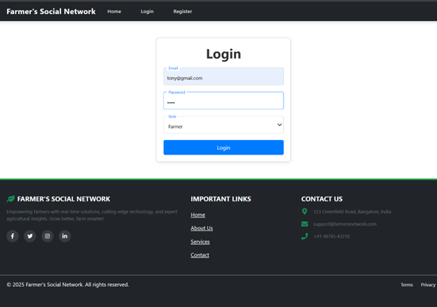 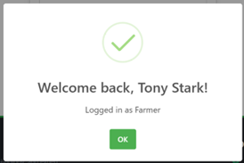  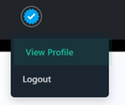 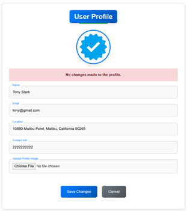

🏠 Dashboards
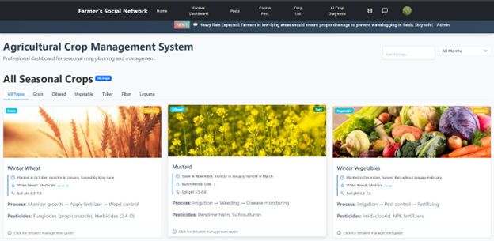 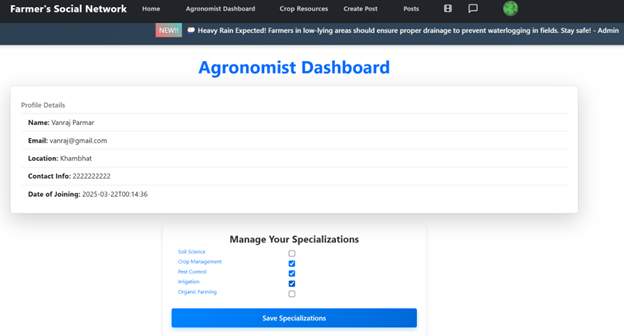 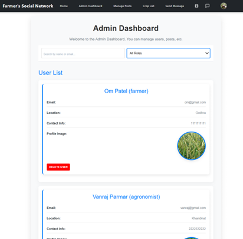

📬 Posts & Comments
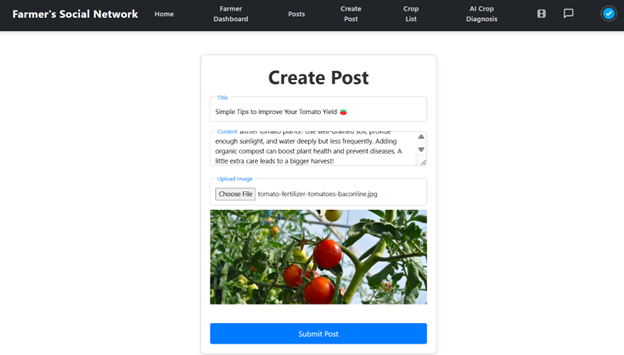  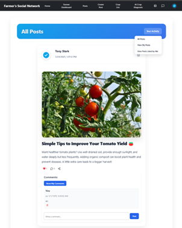 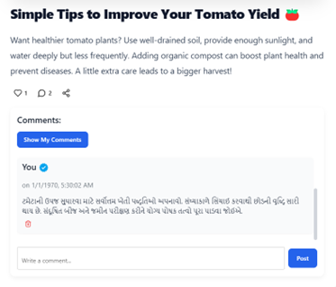 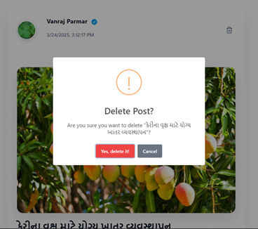

🌱 Crop Resources
  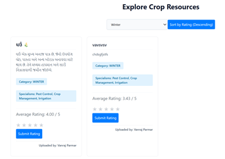 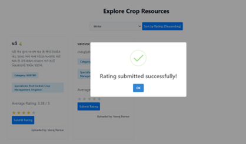 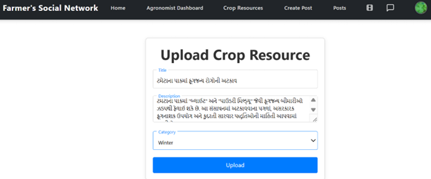 

🤖 AI Crop Disease Prediction
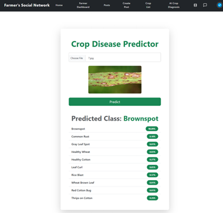

🎬 Shorts / Reels
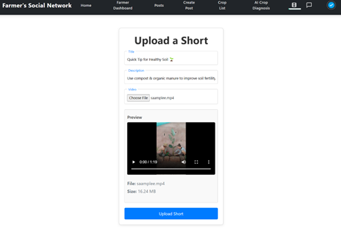 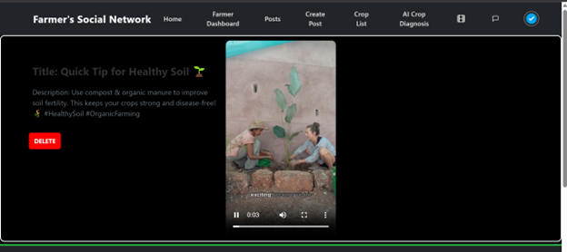 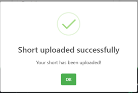

💬 Real-Time Chat
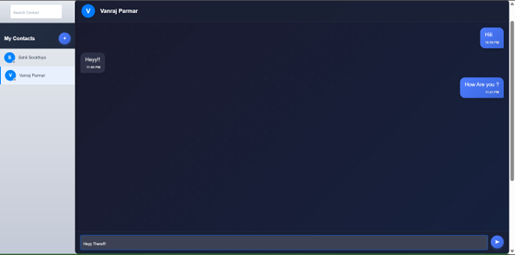 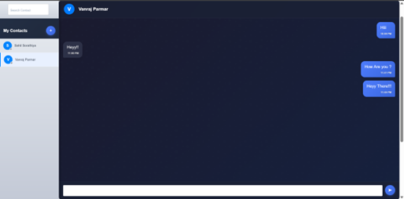 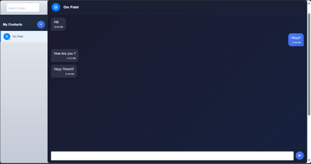

🧑‍💼 Admin Panel
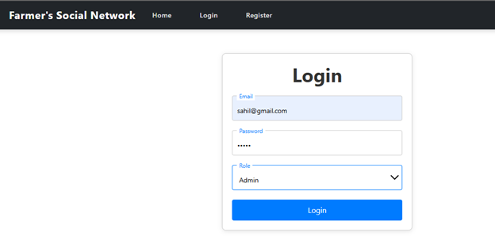  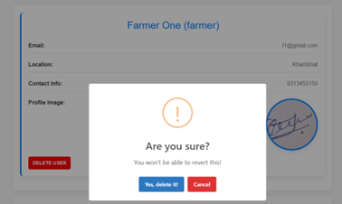  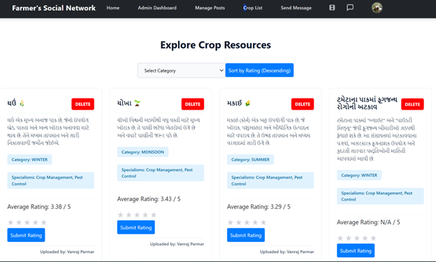 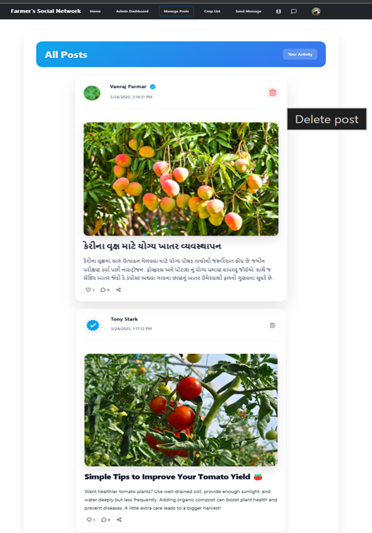 

</details>
🚀 Future Plans
🌍 Add multi-language support (Gujarati, Hindi, etc.)

☁️ Weather updates, market prices, and auto-recommendations

🤖 Upgrade AI model for more disease classes & precision

📱 Convert to full mobile app with React Native

📚 References
Spring Boot

React.js

Socket.IO

TensorFlow

Kaggle Crop Disease Dataset

✨ Credits
👨‍💻 Developed by

Om Patel (22CEUON123)

Parmar Vanraj (22CEUOT130)

Sorathiya Sahil (22CEUOG040)
👨‍🏫 Guided by Prof. Mrudang T. Mehta
🎓 Dharmsinh Desai University — 2024-2025

<p align="center"> Made with ❤️ for farmers and innovation 🌱 </p> ```

## 💻 Run the Project

```bash
# Spring Boot Backend
cd springboot-backend
./mvnw spring-boot:run

# React Frontend
cd main-frontend
npm install
npm start

# Node Chat Backend
cd chat-backend
npm install
node server.js
